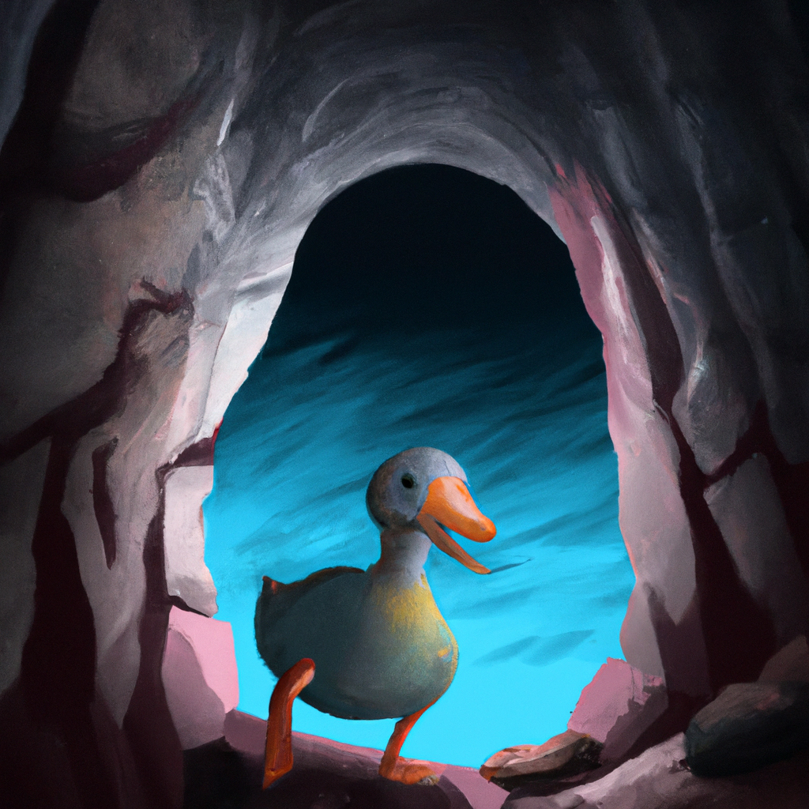
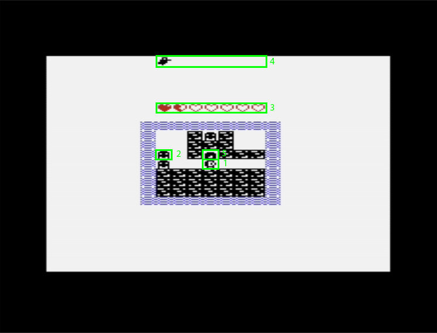
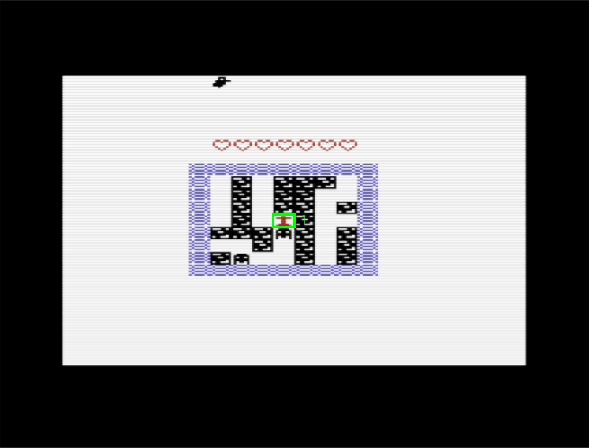
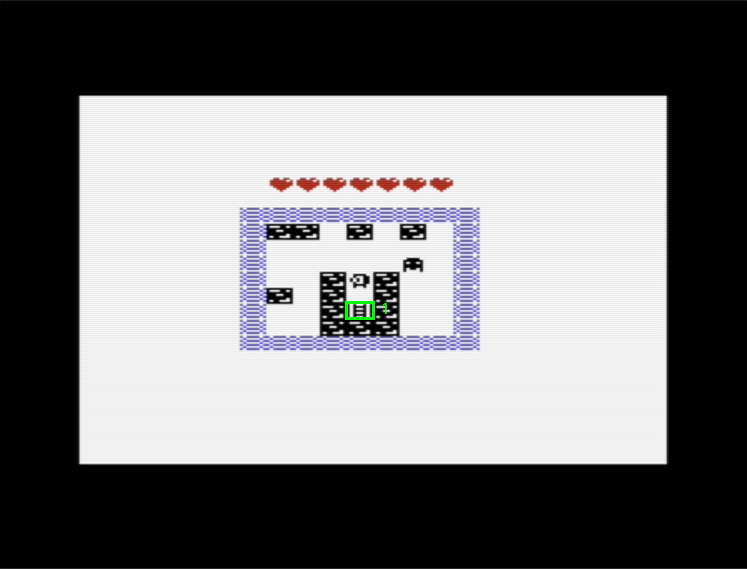
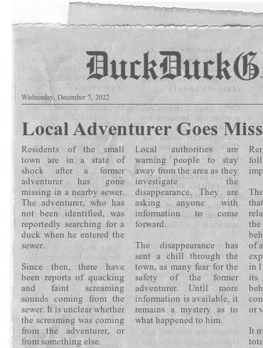

  

# 
Bubbie the VIth

  <strong>Duck down into the depths!</strong>

You are a former adventurer who, after cashing in big on a previous adventure, has settled down to live a peaceful life. However, you're starting to feel lonely and unfulfilled as you realize that you haven't spent any time developing social skills and that money can't buy you the excitement of adventure. One day, your cute neighbour, Besty, comes to you looking for help! Her pet duck, Bubbie, has wandered off into the sewers by accident! Motivated by your post-retirement crisis and desire for a connection with Besty, you agree to look for Bubbie, leading you into the sewers which spiral down into the depths of the earth far further than you anticipated. As the dangers grow, the deeper you track Bubbie, the question burns in your mind: "How the hell did that damn duck make it this far?"

## Game Compilation
Execute the command `make` in this directory to compile the game. The game will be generated in bin/ as 'bubbie.prg'  
Note: You will need to change the compiler path in the Makefile to match your setup.  

**Important: Three directories are required to compile the game, this current directory, 'justinLib/', and 'lib/'.** (I'd assume this won't be a problem, as you've pulled the entire repository.)

## Playing the Game
Once the game is compiled, you can run it in your favourite emulator.  

When you start the game, you will be presented with a title screen. Press any key to start the game (Due to how the input loop is designed, to allow us to play music on the title screen, you'll need to hold the key down for ~0.2 seconds before the game will start).

## Game Objective
The objective of the game is to find and collect 7 ducks. Each "level" contains 1 duck that can be collected. The game ends when you have collected all 7 ducks.  
You can go further down the sewers by finding ladders, which will spawn randomly around the map. When you find a ladder, you can go down to the next level. You can only go down, not up. Each "level" will randomly place the ladder, the duck, and the enemies.

## Game Controls
* **W** - Move Up
* **A** - Move Left
* **S** - Move Down
* **D** - Move Right

## Game Actions
* **Attack** - To attack the enemy you must face the direction the enemy is in and move towards them.

## In-Game Images

* **1** - The main character, Bubbie the VIth, is alive. (Start of the game)
* **2** - The enemy, a rat, which will attack the main character if they are in the same location.
* **3** - The health bar, which will decrease when the main character is attacked by an enemy. The health bar will reset when they go through a ladder.
* **4** - The score, will increase by 1 when the main character collects a duck.
* **5** - The duck, which is the objective of the game. 

* **1** - The main character, Bubbie the VIth, is dead. (End of game)

* **1** - The ladder, which acts as a "portal" to the next level.

## Paratext 

* The logo for the game, Bubbie the VIth.

* News article discussing the disappearance of a local adventurer in the sewers, and the subsequent search for him by the local police.

## Known Bugs
* The enemy will damage you before you can attack them as they parallelly move based on your direction.
* An enemy spawns sometimes when we move and the main character overlaps them.
* Enemy sometimes moves into the main character's location but doesn't attack.
* Enemy can phase through the map walls and for a single iteration second the wall block they moved through disappears and returns at the beginning of the next iteration.

## Credits
Not Enough Memory, 2022  
Justin Parker, Emmett Collings, Ricky Bhatti, Abdelhak Khalfallah

DALL-E 2 - Bubbie the VIth Logo (License: https://labs.openai.com/policies/content-policy)