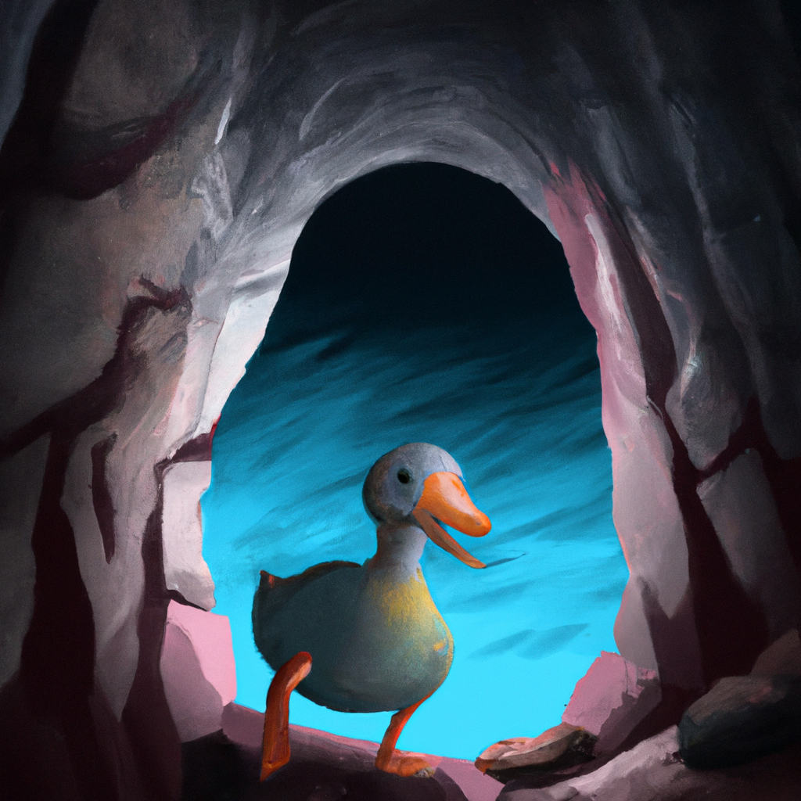

  

# 
Bubbie the VIth

  <strong>README</strong>

## Game Compilation
Execute the command `make` in this directory to compile the game. The game will be generated in bin/ as 'bubbie.prg'  
Note: You will need to change the compiler path in the Makefile to match your setup.  

**Important: Three directories are required to compile the game, this current directory, 'justinLib/', and 'lib/'.** (I'd assume this won't be a problem, as you've pulled the entire repository.)

## Known Bugs
* The enemy will damage you before you can attack them as they parallelly move based on your direction.
* An enemy spawns sometimes when we move and the main character overlaps them.
* Enemy sometimes moves into the main character's location but doesn't attack.
* Enemy can phase through the map walls and for a single iteration second the wall block they moved through disappears and returns at the beginning of the next iteration.
